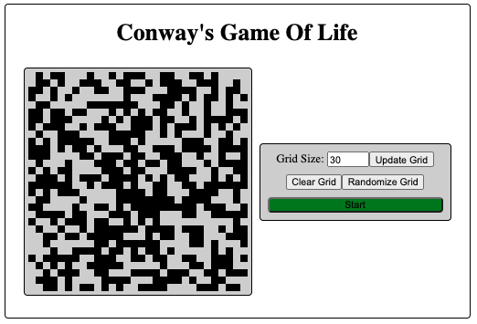
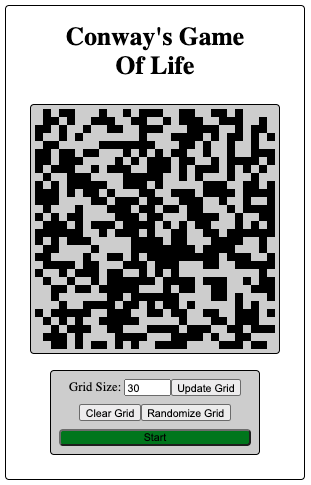
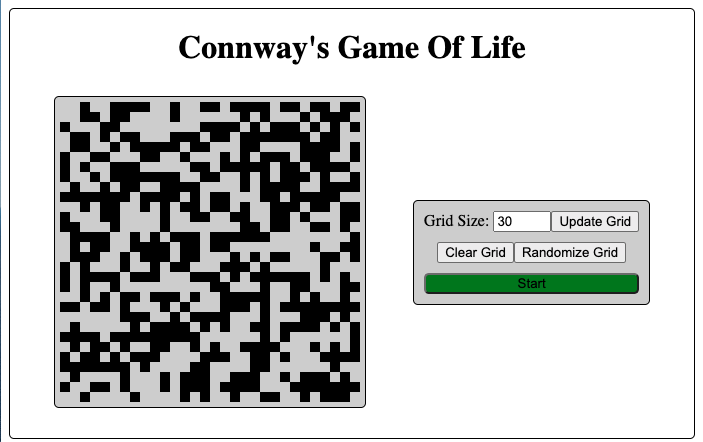

# Conway's Game of Life

🌎 [Live Project Link](https://turgeon-gameoflife.netlify.app) 🌎

"The Game of Life, also known simply as Life, is a `cellular automaton` devised by the British mathematician John Horton Conway in 1970. It is a `zero-player game`, meaning that its evolution is determined by its initial state, requiring no further input. One interacts with the Game of Life by creating an initial configuration and observing how it evolves. It is `Turing complete` and can simulate a universal constructor or any other Turing machine."  
        ~[Link](https://en.wikipedia.org/wiki/Conway%27s_Game_of_Life)

John Conway on inventing the Game of Life: [YouTube Video](https://www.youtube.com/watch?v=R9Plq-D1gEk)

| Term                | Definition | Link                                                            | 
| ---                 | ---        | ---                                                             | 
| Cellular Automaton | A cellular automaton is a collection of "colored" cells on a grid of specified shape that evolves through a number of discrete time steps according to a set of rules based on the states of neighboring cells        | [Link](https://mathworld.wolfram.com/CellularAutomaton.html)    |
|  Turing Complete    |  A system of data-manipulation rules (such as a computer's instruction set, a programming language, or a cellular automaton) is said to be Turing-complete or computationally universal if it can be used to simulate any Turing machine. This means that this system is able to recognize or decide other data-manipulation rule sets.   | [Link](https://en.wikipedia.org/wiki/Turing_completeness)               |

# Game Rules
- "Live" Cell:  

    1. Cells with < 2 neighbors `die` (underpopulation)
    2. Cells with 2 or 3 neighbors `live` on to next generation
    3. Cells with > 3 neighbors `die` (overpopulation)

- "Dead" Cell:

    1. A cell with 3 neighbors becomes `live`

# Implementation

## Structure
1. Game Board => CSS Grid
2. Game State => 2D Array

    ```javascript
        grid [2] [3]
              ^   ^
             col  row 
    ```
3. Cell State

    `0` = Dead  
    `1` = Live

## Steps
1. Build empty Grid 
2. Set Initial State  
    A - Random => Loop through all cells and randomly fill with `0` or `1`  
    B - Pre Defined => Developer created or community built initial configurations    
    C - User Created => starting with all `0's` a user can click to change a cell state before starting the simulation 
3. Render Initial State (Generation: 0)
4. Run Simulation  
    `A` - Update application `running` state  
    `B` - Iterate through the `<App />` state grid   
    `C` - Count neighbors for individual cells  
    `D` - Update individual cells based on game rules regarding number of neighbors     
    `E` - Immutably update `<App />` state grid  
    `F` - Utilize a timeout to space out simulation iterations  
    `G` - Loop back to A 

# Versions
<details>
<summary>1.1.0 - Favicon Update</summary>
</details>

<details>
<summary>1.0.0 - Live Hosting</summary>

[Live Project Link](https://turgeon-gameoflife.netlify.app)

</details>

<details>
<summary>0.6.0 - Responsive Design: Desktop First</summary>

- `Desktop First` uses a `max-width` approach to media breakpoints
    - Desktop = Base Styles
    - Mobile @ `640px`
    - TODO: Grid resizing can negativly effect responsive styling. Need to find a way to attach breakpoints to the width of the `<GridContainer />` within the `<Game />`.

Desktop Styles:  


Mobile Styles:  


</details>

<details>
<summary>0.5.0 - Initial Simulation w/ Initial Styling</summary>



- Simulation is working! Logic is comprised of 4 functions
    1. `toggleSimulation()`  
        - Updates `isRunning` state & a direct update to the `runningRef.current` as to prevent a race condition
    2. `runSimulation() = useCallback(() => {...})` 
        - uses the `useCallback` hook to memoize the function (only made once) unless a dependency changes
        - uses a `runningRef` to access `isRunning` state to check if the simulation is still running => aka should it call another iteration
        - uses a `setTimeout()` to space out iterations
    3. `runIteration()`
        - uses immer's `produce()` function for immutable state  updates
        - loops through all cells and calls `countNeighbors()`
        - executes individual `<Cell />` state updates based on game rules regarding number of neighbors     
    4. `countNeighbors()`
        - util function that loops through all neighbors and sums their individual state values. This will get the number of indivdual "live" cells (`<Cell />` state === `1`) surrounding the `<Cell />`
         
- Separated / Expanded Util Functions:  
    1. `empty2Dgrid()`
    2. `randomGrid()`
    3. `clearGrid()`
    4. `countNeighbors()`

</details>

<details>
<summary>0.4.0 - User Created Initial State</summary>

- `<Cell />` components have an onClick function passed from `<App />` that uses [immer](https://www.npmjs.com/package/immer) to immutably update the `<App />` grid state with the toggled individual `<Cell />` status
- `<AppStateForm />` can now clear the randomly generated initial board => This combined with the ability to toggle individual cells allows the user to generate their own initial state / generation 0

- `<Cell />` Props:  
    - Removed:
        1. `status`={ `grid[col][row]` }

    - Updated Props:  
        1. `key`={ `col`-`row` } => Unique Identifier
        2. `grid` = { `grid` } => Game State
        3. `i` = { `i` } => Column
        4. `k` = { `k` } => Row
        5. `toggleCellStatus` = { `toggleCellStatus` } => Individual Cell Interaction

- `<AppStateForm />` Props:
    - Updates Props:
        1. `randomize` = { `randomize` }
        2. `clear` = { `clear` }
        3. `currentSize` = { `size` }
        4. `setSize` = { `setSize` }
        5. `isRunning` = { `isRunning` }
        6. `toggleSimulation` = { `toggleSimulation` }

- Set Initial State  
    ✅ - Random  
    ❌ - PreDefined  
    ✅ - User Created (onClick interaction)  
</details>
<details>
<summary>0.3.0 - Grid Resizing</summary>

- User can update the size of the intial grid through the `<AppStateForm />` component

- `<App />` State Updates:
    - Removed:
        1. [cols, setCols]
        2. [rows, setRows]
    
    - Updated State:
        1. [size, setSize]

- `<AppStateForm />` Props:
    1. `currentSize` = { `size` } => current `size` hook state from `<App />`
    2. `setSize` = { `setSize` } => `size` stateSetter function from `<App />` to be used on `<AppStateForm />` form submission 
</details>
<details>
<summary>0.2.0 - Genration 0</summary>

- Using CSS Grid and the various `<App />` component hook states to render the appropriate number of columns and rows
- Individually each row and column is made up of rendering individual `<Cell />` components which recieve the following props:  
    1. `key` = { `col`-`row` }
    2. `status` ={  `grid[col][row]` }
- `<Cell />` components are individually styled so that a `0` / `dead` status is black and a `1` / `live` status is white.  

- Set Initial State  
    ✅ - Random  
    ❌ - PreDefined  
    ❌ - User Created (onClick interaction)  
</details>

<details>
<summary>0.1.0 - Initial Commit</summary>

- Initial Project Outline / Explanation
- Rendering `Hello World` after cleaning out initial Create React App project structure
</details>
 